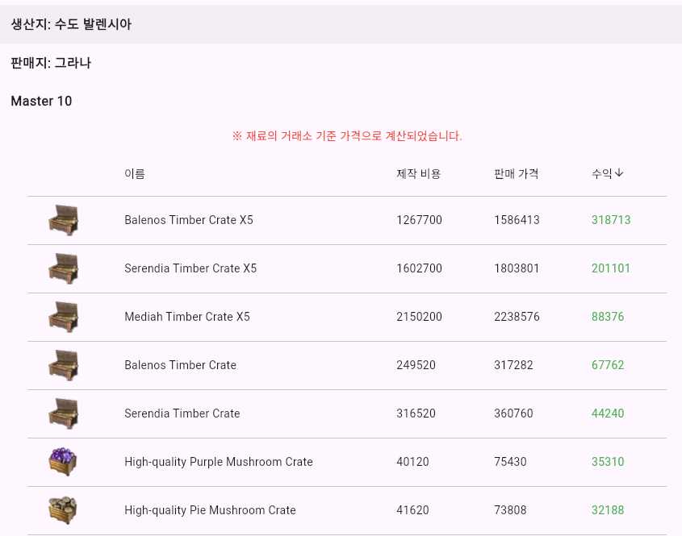
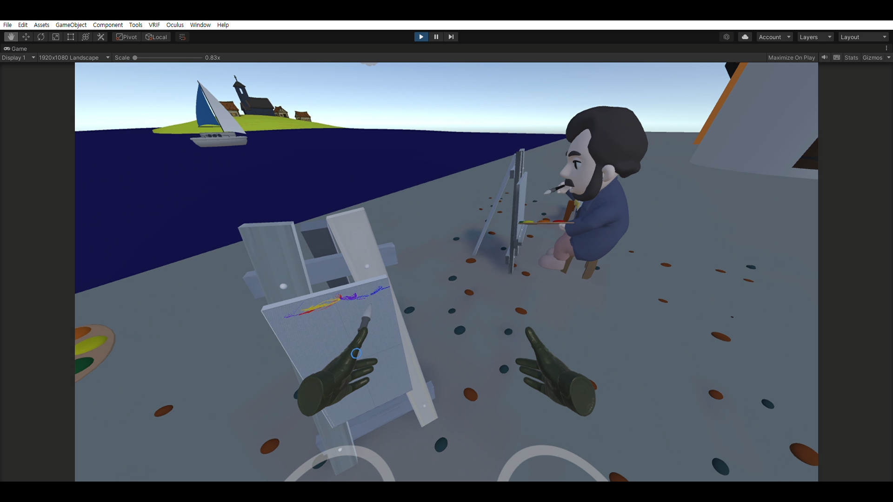
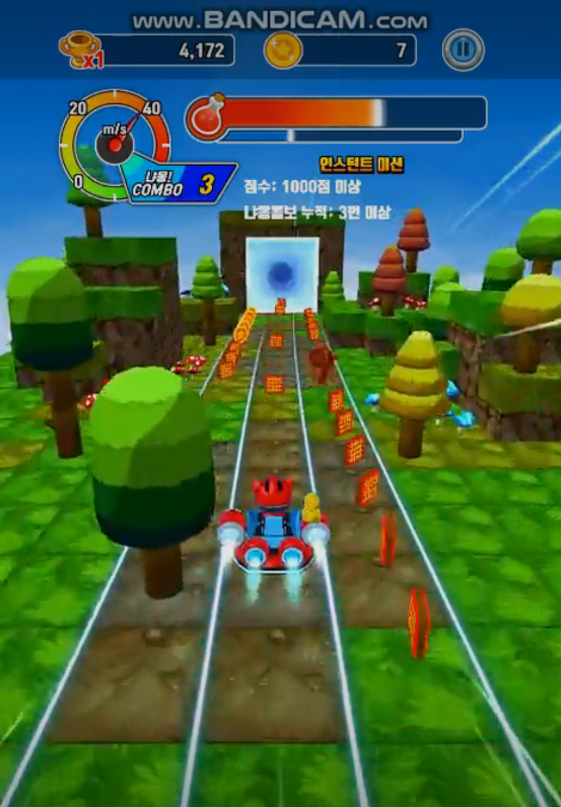
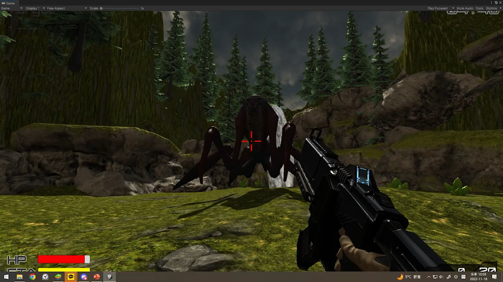

### Link
https://sms1875.github.io/portfolio/

## About Me

|  | 새로운 것에 도전하는 것을 좋아하는 개발자입니다. 어릴 때 게임에서 느낀 즐거움을 다른 사람에게 주고 싶어서 개발자를 꿈꾸게 되었습니다. 다양한 분야에서 끊임없이 도전하며 프로젝트를 만들어 나가고 있습니다. 사용자에게 만족감과 가치를 주는 'things'를 만드는 것을 목표로 하고 있습니다. |
| ------------------------------------------------ | ----------------------------------------------------------------------------------------------------------------------------------------------------------------------------------------------------------------------------------------------------------------------------------------------------------------------------------------------------------------------- |

## Skills

- **Frontend:**   
- **Backend:**  
- **Database:**  
- **Others:**  

## Projects

### Game Paper
.jpg) .jpg).jpg) .jpg).jpg)
- **Description:** 게임 홈페이지에서 제공되는 월페이퍼를 쉽게 모바일 기기의 잠금화면, 홈 화면에 적용하는 플러터 앱입니다
- **Tech Stack:** Flutter, Firebase
- **Link:** [https://play.google.com/store/apps/details?id=com.sms1875.wallpaper](https://play.google.com/store/apps/details?id=com.sms1875.wallpaper) 

### BDO Things

- **Description:** 온라인 게임 검은사막의 아이템 거래소 가격을 기준으로 가공무역 수익을 계산해주는 사이트입니다
- **Tech Stack:** Flutter, Firebase, node.js, aws
- **Link:** [https://github.com/sms1875/bdo_things_flutter](https://github.com/sms1875/bdo_things_flutter) 

### VR 체험형 미술 게임

- **Description:**  VR 체험형 미술 게임의 컨텐츠 및 VR기기를 이용한 드로잉 툴을 제작하였습니다
- **Tech Stack:** Unity, Oculus VR
- **Link:** [https://www.youtube.com/watch?v=bbDlDIro5ck](https://www.youtube.com/watch?v=bbDlDIro5ck)

### 러닝캣:달릴고양 리마스터 프로젝트

- **Description:** 충북 글로벌 게임 센터에서 진행한 팀 프로젝트에 참여하여 딜리셔스 게임즈의 '러닝캣: 달릴 고양이' 게임 개선 및 추가 컨텐츠 개발을 진행하였습니다.
- **Tech Stack:** Unity, SVN
- **Link:** [https://cbgame.org/sub.php?code=23&mode=view&no=69&category=&page=1&search=&keyword=](https://cbgame.org/sub.php?code=23&mode=view&no=69&category=&page=1&search=&keyword=)

### 졸업작품 FPS 게임

- **Description:** 유닛이 체스 규칙을 통해 움직이고 이벤트가 발동하는 3D 로그라이크 FPS 게임입니다.
- **Tech Stack:** Unity

### Escape Dungeon

- **Description:** 고양이를 피해 아이템을 얻어 탈출하는 간단한 탈출 게임입니다.
- **Tech Stack:** Unity

### 비대면 강의 중계 어플리케이션
- **Description:** 코로나 시대로 인해 빈 공간을 대여하고 온, 오프라인 수업을 중계하는 플랫폼 개발 프로젝트입니다.
- **Tech Stack:** Android Studio, Kotlin, Google Maps, Firebase
- **Link:** [https://github.com/sms1875/AppProject](https://github.com/sms1875/AppProject) 

## Experience

### 행복한다람쥐단 (2023.09 - 2023.12)

- **Role:** 프론트엔드 개발
- **Responsibilities:** 유니티 WebGL 메타버스 환경에서 참여할 수 있는 WebRTC 화상회의 플랫폼 개발 및 API 구현, OTP등 인증 로직 개발을 진행하였습니다.

### 아트앤메타 (2022.10 - 2022.12)

- **Role:** Frontend Developer
- **Responsibilities:** VR 미술 게임의 컨텐츠와 드로잉 툴을 개발하였습니다.
- **Implementation:** 플레이어 조작, NPC 상호작용, 게임 흐름 이벤트 제어, 붓 등의 오브젝트를 통한 드로잉 및 프로타주 등 다양한 미술 기법

## Education

- **SSAFY 12기** - Embedded Robot Track 참여중 (2024~)
- **충북글로벌게임센터 게임아카데미** - 유니티 프로그래밍 교육 (2022)
- **충북대학교** - 컴퓨터공학과 졸업 (2017-2022)

## Certifications

- **정보처리기사** (2024)
- **OPIC IM2** (2024)
- **TOPCIT Level 3** (2021)
